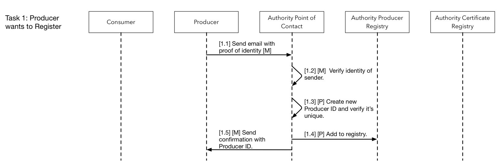
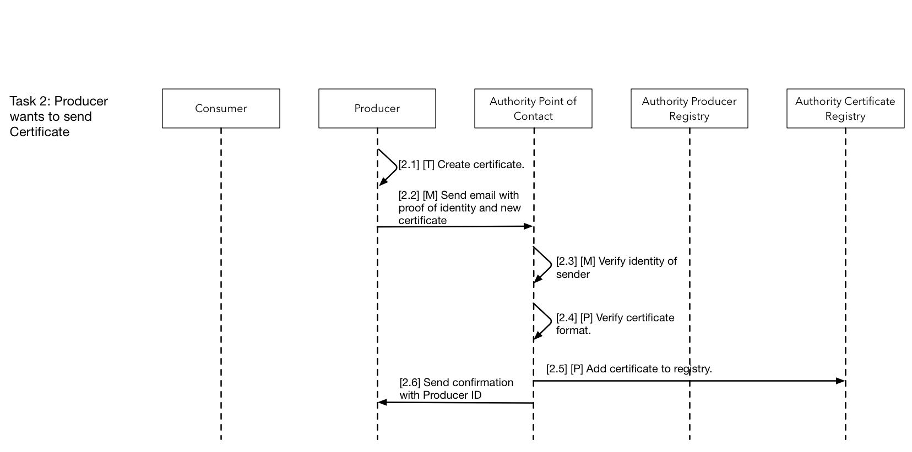
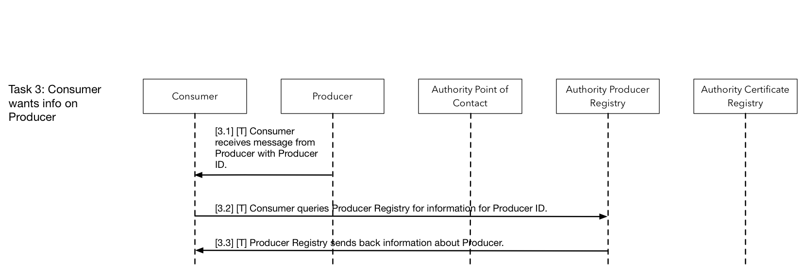
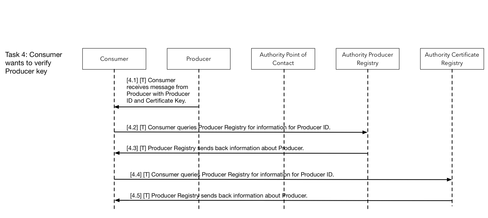

# DUL Authority Tool

## Workflows

Key to diagrams:

 - [M] - Manual task
 - [P] - Task uses DUL Authority Tool.
 - [T] - Task uses second / third party tool.

### Task 1: Producer wants to Register 

#### Description

#### Steps

 - 1.1 Producer: Send email with proof of identity.
 - 1.2 Authority Contact: Verify Identity of sender.
 - 1.3 Authority Contact: Create new Producer ID and verify it's unique.
 - 1.4 Authority Contact: Add Producer ID to registry.
 - 1.5 Authority Contact: Send confirmation with Producer ID.

#### Failure conditions

 - 1.2 Authority Contact is unable to verify identity of Producer.
     - Authority should contact Producer to verify by other means. 
     - If not possible, verification cannot continue.

### Task 2: Producer wants to send Certificate

#### Steps

 - 2.1 Producer: Create certificate using own tool
     - Format of certificate should be JWK using RSA256 algorithm
 - 2.2 Producer: Send email with proof of identity and new certificate 
 - 2.3 Authority Contact: Verify identity of sender
 - 2.4 Authority Contact: Verify certificate format
 - 2.5 Authority Contact: Add certificate to registry
     - Registry Tool should assign an ID to the key
     - A JWK JKU URL should be returned.
 - 2.6 Producer: Send confirmation with Producer ID
     - The JKU should be sent back to the Producer for inclusion in future messages.

#### Failure Conditions

 - 2.3 Authority Contact is unable to verify identity of Producer
     - Authority should contact Producer vo verify by other means.
     - If not possible, process cannot continue.
 - 2.4 Authority Contact is unable to verify format of certificate
     - If certificate is not JWK 256 then it should be rejected.

### Task 3: Consumer wants info on Producer

 - 3.1 Consumer receives message from Producer with Producer ID.
 - 3.2 Consumer queries Producer Registry for information for Producer ID.
 - 3.3 Producer Registry sends back information about Producer.

### Task 4: Consumer wants to verify Producer key

 - 4.1 Consumer receives message from Producer with Producer ID and Certificate Key.
 - 4.2 Consumer queries Producer Registry for information for Producer ID.
 - 4.3 Producer Registry sends back information about Producer.
 - 4.4 Consumer queries Producer Registry for information for Producer ID.
 - 4.5 Producer Registry sends back information about Producer.

